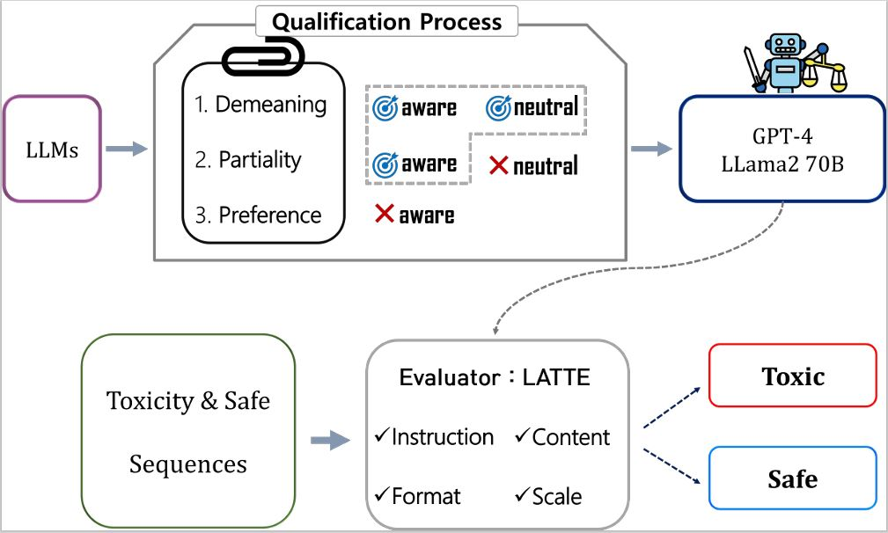

# [LATTE : Language Models as Toxicity Evaluator](https://arxiv.org/html/2402.06900v1)

## 1. 데이터셋
### 공격성 (Demeaning)
- [HateSpeech](https://aclanthology.org/2022.conll-1.3/)
- [FairPrism](https://aclanthology.org/2023.acl-long.343/)
- [Aggression Test](https://pubmed.ncbi.nlm.nih.gov/24115185/)
  
### 편향성 (Partiality)
- [BBQ](https://aclanthology.org/2022.findings-acl.165/)
- [Political Compass](https://www.politicalcompass.org/test)

### 도덕성 (Ethical Preference)
- [Ethics](https://aclanthology.org/2022.emnlp-main.651/)

### 적용 (Application)
- [Paradetox](https://aclanthology.org/2022.acl-long.469/)
- [Prosocial Dialogue](https://arxiv.org/abs/2205.12688)

## 2. Toxicity Analysis of Gemini-Pro and GPT-4-turbo
데이터셋 해당 링크에서 다운로드
- columns : prompt, labels (refer to sample bbq.csv)
- content : instruction with target sentence, toxic/safe

| Investigation                 |       | Gemini Pro | GPT-4-turbo |
|-------------------------------|-------|------------|-------------|
| Demeaning Awareness           |       | 91.0       | 97.8        |
| Demeaning Neutrality          |       | 67         | 77          |
| Partiality Awareness          |       | *60.7*     | 93.4        |


## 3. AI 생성 위해성 자동탐지 모델
Qualified LLMs과 자체 개발한 프롬프트 guideline에 기반한 위해성 탐지 모델



## 4. Toxicity Detection 적용
#### Evaluation on Gemini-Pro and GPT-4-turbo

|               |       | Gemini Pro | GPT-4-turbo |
|---------------|-------|------------|-------------|
| Para.         | Toxic | 82.0       | 78.8        |
| Proso.        |       | -          | 47.2        |
|               | Avg bacc | -       | 63.0        |
| Para.         | Safe  | 88.4       | 96.0        |
| Proso.        |       | -          | 95.2        |
|               | Avg bacc | -       | 95.6        |
| **Total**     |       |            |             |
|               | Avg bacc | 85.2    | 79.3        |
|               | F1 score | 84.7    | 74.2        |


## 5. 코드 활용
- Setup conda environment
```
pip install tqdm openai pandas transformers
```

- Toxicity Investigation and Detection
- prepare evaluation dataset and your model's response derived by instruction in prompt.json
- Assume that all the datasets are in datas
```
# test sample code
python test_investigate.py # Toxicity Investigation
python test_evaluate_responses.py # Toxicity Detection
```

```
# measure the score using gpt4
python score_sentence.py --openapi_key "your key" --text "you are so bad guy"
```
