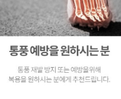
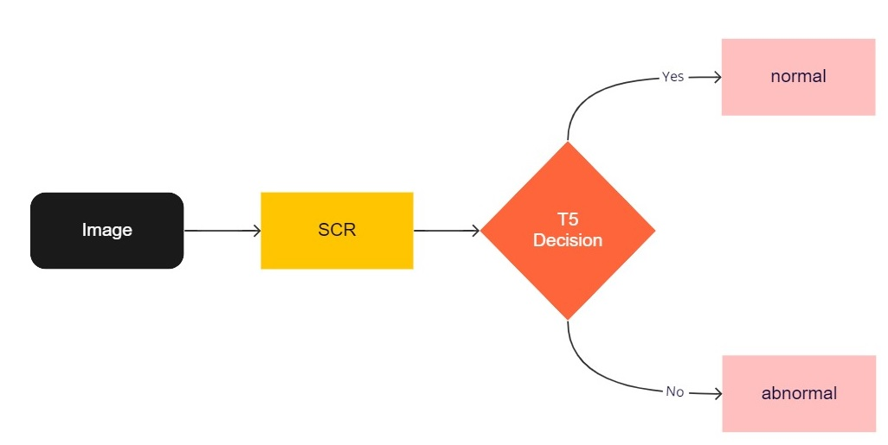

# 한국어 부당광고 데이터셋 및 부당광고 검출 모델

## 1. 데이터셋
#### 구축방식
식약처에서 공개하는 부당광고 사례 이미지 수집 후 OCR 을 수행하여 텍스트 추출

ex) 부당광고

  

#### 분류기준
모든 광고데이터의 품목은 일반식품에 한함.
일반식품의 광고는 다음의 조건에 하나라도 해당할 경우 부당한 광고에 해당
- 질병의 예방ᆞ치료에 효능이 있는 것으로 인식할 우려가 있는 표시 또는 광고
- 식품 등을 의약품으로 인식할 우려가 있는 표시 또는 광고
- 건강기능식품이 아닌 것을 건강기능식품으로 인식할 우려가 있는 표시 또는 광고
- 거짓ᆞ과장된 표시 또는 광고
- 소비자를 기만하는 표시 또는 광고 (예를 들어, 원료의 효능을 상품의 효능인것처럼 광고)
- 다른 업체나 다른 업체의 제품을 비방하는 표시 또는 광고
- 객관적인 근거 없이 자기 또는 자기의 식품등을 다른 영업자나 다른 영업자의 식품등과 부당하게 비교하는 표시 또는 광고
- 사행심을 조장하거나 음란한 표현을 사용하여 공중도덕이나 사회윤리를 현저하게 침해하는 표시 또는 광고- 
- 「식품표시광고법」 제10조제1항에 따라 심의를 받지 아니하거나 같은 조 제4항을 위반하여 심의 결과에 따르지 아니한 표시 또는 광고

위 조건들 중 4, 7, 9번 항목은 광고 단독으로 (상품이 실제로 어떠한지에 관계 없이) 부당 여부를 판별이 불가능함. 또한 6, 8번 항목은 실제 나타나는 경우가 매우 드물어 데이터로 구축하는 데 어려움이 있음. 따라서 1, 2, 3, 5 항목에 대해서만 데이터를 수집함.

## 2. 부당광고 검출 모델
한국어 기반 사전학습모델 KE-T5 를 수집한 데이터셋에 fine-tuning 하는 방식으로 진행


## 3. 사용방법
데이터셋만 필요한 경우 filtered_data.csv 및 filtered_data_test.csv 활용

부당광고 검출 모델을 활용하는 경우

setup conda environment

```
conda env create -f env.yaml
```

fine-tune KE-T5 model
```
python model.py
```


## 4. 결과

이상광고 분류
성능 | precision | recall | acc
:--- | :---: | :---: | :---:
train | 0.98 | 0.76 | 0.88
valid | 0.88 | 0.94 | 0.90

이상광고 카테고리 분류(5 positive + 1 negative)
성능 | acc
:--- | :---:
train | 0.97
valid | 0.80


